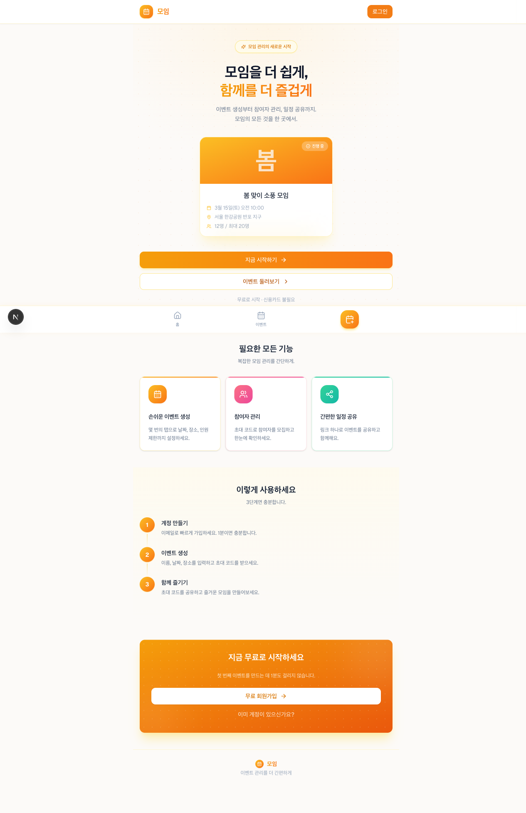
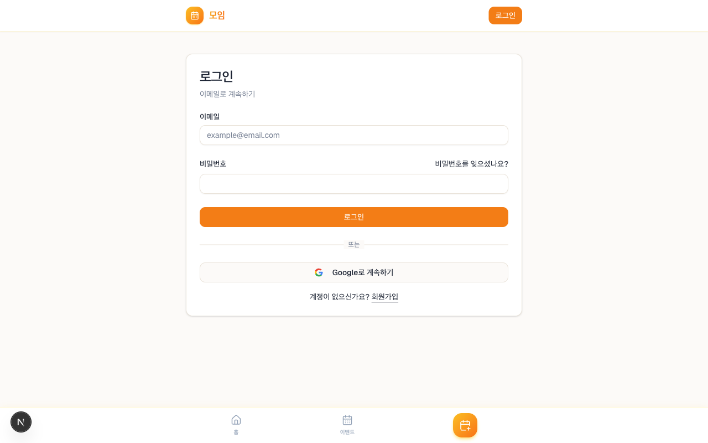
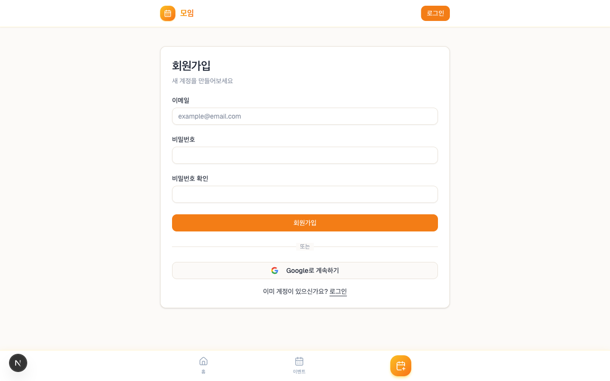
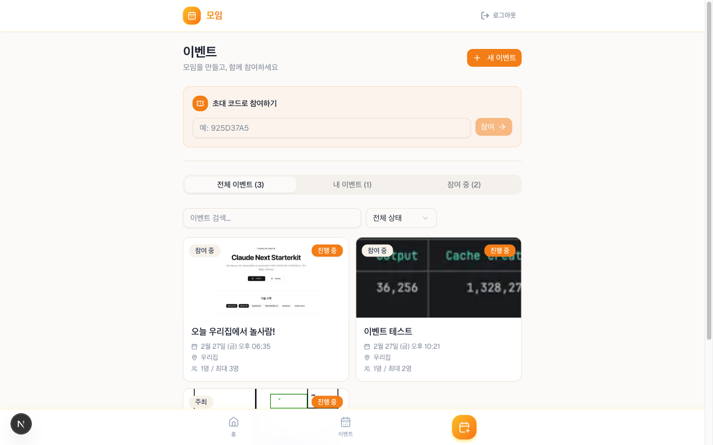
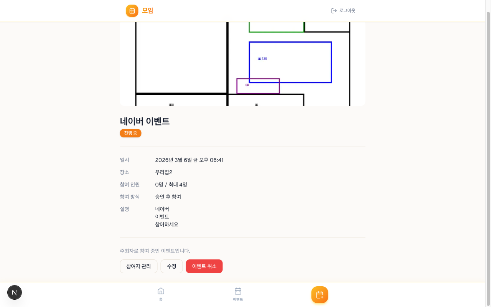
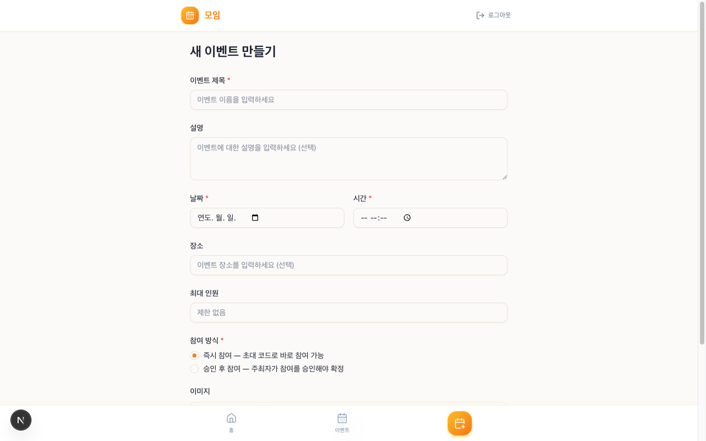
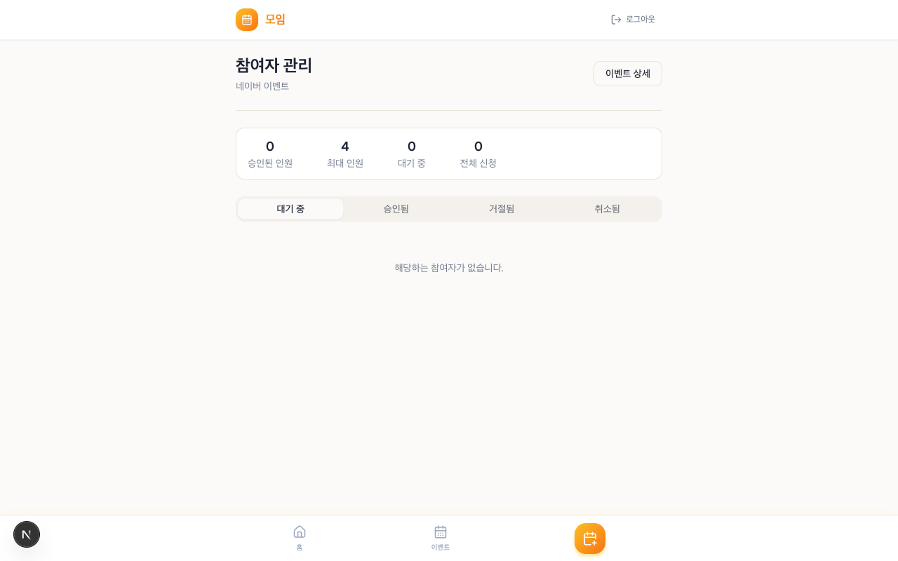

# 모임 매니저 (Meeting Manager)

> 소규모 모임의 생성부터 공지까지, 운영 전 사이클을 하나의 서비스에서.

초대 링크 하나로 이벤트를 공유하고, 참여 신청·승인·공지·댓글을 단일 웹 서비스에서 완결하는 **모임 운영 플랫폼**입니다.
카카오톡, 구글폼, 스프레드시트를 오가는 파편화된 운영 방식을 대체합니다.

---

## 목차

- [프로젝트 개요](#프로젝트-개요)
- [핵심 기능](#핵심-기능)
- [서비스 흐름](#서비스-흐름)
- [주요 화면](#주요-화면)
- [기술 스택](#기술-스택)
- [아키텍처](#아키텍처)
- [데이터베이스 스키마](#데이터베이스-스키마)
- [프로젝트 구조](#프로젝트-구조)
- [로컬 개발 환경 설정](#로컬-개발-환경-설정)
- [코드 품질 도구](#코드-품질-도구)

---

## 프로젝트 개요

### 해결하는 문제

수영 모임, 헬스 스터디, 독서 클럽 등 **소규모 정기 모임(5~20명)** 주최자는 세 가지 고통을 겪습니다.

| 문제               | 기존 방식                                                     |
| ------------------ | ------------------------------------------------------------- |
| 도구 파편화        | 안내(카카오톡) + 신청(구글폼) + 공지(단톡방)를 각각 따로 관리 |
| 참여자 관리 비효율 | 승인/거절을 수작업으로 처리하고 현황을 별도 기록              |
| 소통 누락          | 공지가 채팅 메시지에 묻혀 중요 정보를 놓치거나 재공유         |

### 핵심 가치 제안

> **"초대 링크 하나로 모임의 생성부터 공지까지, 모든 운영을 한 곳에서"**

- 별도 앱 설치 없이 웹 브라우저로 즉시 사용
- 비로그인 상태에서도 초대 링크로 이벤트 미리보기 가능 — 가입 장벽 최소화
- 역할(주최자 / 승인 참여자 / 대기 참여자)에 따라 딱 필요한 기능만 노출되는 UX

---

## 핵심 기능

| ID   | 기능                | 설명                                                               |
| ---- | ------------------- | ------------------------------------------------------------------ |
| F001 | 이벤트 생성         | 제목·날짜·장소·최대 인원·참여 방식 입력, 8자리 초대 코드 자동 발급 |
| F002 | 이벤트 수정/취소    | 주최자가 이벤트 정보 수정 또는 상태를 cancelled로 변경             |
| F003 | 내 이벤트 목록      | 전체/주최/참여 탭으로 이벤트 현황 파악                             |
| F004 | 초대 코드 미리보기  | 비로그인 포함 누구나 `/invite/[code]`로 이벤트 기본 정보 열람      |
| F005 | 참여 신청/취소      | open → 즉시 승인, approval → pending 대기, 참여 취소 가능          |
| F006 | 참여자 승인/거절    | 주최자가 pending 신청자를 개별 승인·거절, 정원 초과 방지           |
| F007 | 공지 작성/수정/삭제 | 주최자 전용 이벤트 공지 관리                                       |
| F008 | 공지 열람           | 승인된 참여자와 주최자만 공지 목록·상세 열람                       |
| F009 | 댓글 작성/삭제      | 승인된 멤버 간 공지 댓글 소통, 본인 댓글 삭제                      |
| F010 | 인증                | 이메일/비밀번호 + Google OAuth 로그인·회원가입                     |

---

## 서비스 흐름

```
[비로그인 사용자]
초대 링크 수신 → /invite/[code] 접속 → 이벤트 기본 정보 열람
  └─ "참여 신청" 클릭 → 로그인 페이지 → 로그인 완료 → 미리보기 페이지 복귀 → 참여 신청

[참여 신청 처리]
  ├─ open(자유참여)    → 즉시 approved → 이벤트 상세 페이지
  └─ approval(승인형)  → pending 상태  → 이벤트 상세 페이지 (제한된 뷰)

[주최자 - 이벤트 생성]
내 이벤트 목록 → "새 이벤트" 클릭 → 정보 입력 → 저장
  → 이벤트 상세 페이지 (초대 코드 확인 + 복사)

[주최자 - 참여자 관리]
이벤트 상세 → "참여자 관리" → pending 목록 확인 → 승인/거절
  └─ 승인 시 정원 초과 자동 검증

[공지 + 댓글 흐름]
이벤트 상세 → 공지 탭 (승인된 멤버만 접근)
  ├─ 주최자: 공지 작성 → 공지 상세 → 수정/삭제
  └─ 승인된 참여자: 공지 열람 → 댓글 작성/삭제
```

---

## 주요 화면

### 홈 페이지



- 서비스 소개 히어로 섹션과 핵심 기능 요약
- 데모 이벤트 카드로 실제 UI를 바로 미리보기
- 비로그인 사용자를 위한 회원가입/이벤트 탐색 진입 유도

---

### 로그인 / 회원가입 페이지

| 로그인                                  | 회원가입                                   |
| --------------------------------------- | ------------------------------------------ |
|  |  |

- 이메일/비밀번호 + Google OAuth 로그인을 단일 폼에서 처리
- 비밀번호 찾기 링크 및 회원가입 페이지 연결
- 초대 코드 진입 시 로그인 후 원래 미리보기 페이지로 자동 복귀

**핵심 구현:** `next/navigation`의 `redirect` + Supabase Auth `signInWithPassword()`

```typescript
// components/login-form.tsx
const { error } = await supabase.auth.signInWithPassword({
  email,
  password,
});
```

---

### 이벤트 목록 페이지



- **전체 / 내 이벤트 / 참여 중** 탭 구조
- 제목 검색 + 상태(active/cancelled/completed) 필터 지원
- 초대 코드 직접 입력으로 빠른 참여 진입
- 이벤트 카드에 승인 인원 / 최대 인원, 날짜, 장소 요약 표시

**핵심 구현:** 3개의 쿼리를 `Promise.all`로 병렬 처리

```typescript
// app/(protected)/events/page.tsx
const [hostedResult, participatingResult, allResult] = await Promise.all([
  getMyHostedEvents(),
  getMyParticipatingEvents(),
  getAllEvents({ search, status }),
]);
```

---

### 초대 코드 미리보기 페이지 (`/invite/[code]`)



- 비로그인 상태에서도 이벤트 기본 정보(제목, 날짜, 장소, 참여 방식, 정원 현황) 열람
- 정원 마감 여부, 이벤트 상태(진행 중/취소/완료)를 배지로 표시
- 이벤트 커버 이미지 지원 (`next/image` 최적화)
- 주최자 접근 시 관리 패널 표시, 일반 사용자에게는 참여 신청 버튼 표시

**핵심 구현:** 비인증 접근을 허용하면서 역할에 따라 UI를 분기

```typescript
// app/invite/[code]/page.tsx
const isHost = isLoggedIn && authData?.claims?.sub === result.host_id;

return isHost ? (
  <HostActionPanel eventId={result.id} />
) : (
  <JoinButton inviteCode={code} isLoggedIn={isLoggedIn} currentStatus={currentStatus} isFull={isFull} />
);
```

---

### 이벤트 생성 페이지



- 제목, 날짜/시간, 장소, 설명, 최대 인원(없으면 무제한) 입력
- **자유참여** / **승인 후 참여** 방식 라디오 선택
- 커버 이미지 업로드 (Supabase Storage, 최대 5MB, JPG/PNG/WebP/GIF)
- 저장 시 서버에서 8자리 대문자 영숫자 초대 코드 자동 생성

**핵심 구현:** Server Action + Zod 스키마 검증

```typescript
// app/(protected)/events/actions.ts
const inviteCode = crypto
  .randomUUID()
  .replace(/-/g, "")
  .slice(0, 8)
  .toUpperCase();
```

---

### 참여자 관리 페이지



- 상태별 탭: **대기 중(pending) / 승인됨(approved) / 거절됨(rejected)**
- 각 참여자의 이름, 이메일, 신청 일시 표시
- pending 항목에서 **승인** / **거절(사유 입력)** 처리
- 승인 인원이 최대 인원에 도달하면 승인 버튼 비활성화 (정원 초과 방지)
- 출석 체크 토글로 참여자 출석 현황 기록

---

## 기술 스택

### Frontend

| 기술           | 버전            | 선택 이유                                                                              |
| -------------- | --------------- | -------------------------------------------------------------------------------------- |
| **Next.js**    | 15 (App Router) | Server Components + Server Actions으로 API 레이어 없이 데이터 처리, 최신 RSC 패턴 적용 |
| **React**      | 19              | 동시성 렌더링, `useActionState` 등 최신 기능 활용                                      |
| **TypeScript** | 5.6+            | Supabase 자동 생성 타입과 연계한 엔드-투-엔드 타입 안전성                              |

### 스타일링 & UI

| 기술                     | 선택 이유                                                                            |
| ------------------------ | ------------------------------------------------------------------------------------ |
| **Tailwind CSS v3**      | 유틸리티 클래스로 빠른 반복 개발, `prettier-plugin-tailwindcss`로 자동 정렬          |
| **shadcn/ui** (new-york) | Radix UI 기반의 접근성 보장 컴포넌트, 소스 코드 직접 소유로 커스터마이징 자유도 높음 |
| **Lucide React**         | shadcn/ui 공식 아이콘 라이브러리, 트리쉐이킹 최적화                                  |

### 폼 & 검증

| 기술                  | 선택 이유                                                               |
| --------------------- | ----------------------------------------------------------------------- |
| **React Hook Form 7** | 비제어 컴포넌트 기반으로 불필요한 리렌더링 최소화                       |
| **Zod 4**             | 스키마 정의와 타입 추론을 동시에 처리, Server Action에서 서버 측 재검증 |

### Backend & Database

| 기술                      | 선택 이유                                                                |
| ------------------------- | ------------------------------------------------------------------------ |
| **Supabase Auth**         | 이메일/비밀번호 + Google OAuth를 설정 없이 지원, JWT 기반 세션 쿠키 관리 |
| **PostgreSQL (Supabase)** | RLS(Row Level Security)로 역할 기반 데이터 접근 제어를 DB 레벨에서 보장  |
| **Supabase Storage**      | 이벤트 커버 이미지 저장, 공개 버킷으로 CDN 제공                          |
| **@supabase/ssr**         | Next.js App Router의 서버/클라이언트 환경에서 쿠키 기반 세션 동기화      |

### Infra / DevOps

| 기술                       | 선택 이유                                                         |
| -------------------------- | ----------------------------------------------------------------- |
| **ESLint 9** (flat config) | Next.js 권장 규칙 + Prettier 충돌 방지 설정                       |
| **Prettier**               | `prettier-plugin-tailwindcss`로 Tailwind 클래스 자동 정렬         |
| **Husky + lint-staged**    | git commit 시 staged 파일만 린트/포맷 자동 실행, 코드 품질 게이팅 |

### Deployment

| 기술       | 선택 이유                                                                 |
| ---------- | ------------------------------------------------------------------------- |
| **Vercel** | Next.js 15 Edge Runtime 및 Fluid Compute 최적화 배포, 환경 변수 자동 연동 |

---

## 아키텍처

### Supabase 클라이언트 3계층 구조

Next.js의 서버/클라이언트 경계에 따라 세 가지 클라이언트를 분리 사용합니다.

```
lib/supabase/
├── client.ts       # "use client" 환경 (브라우저)
├── server.ts       # Server Components, Server Actions, Route Handlers
└── proxy.ts        # Next.js 미들웨어 전용 (세션 쿠키 갱신)
```

> **중요:** Vercel Fluid Compute 환경에서 서버 클라이언트를 전역 변수에 저장하면 세션이 끊길 수 있습니다. 항상 함수 내부에서 새로 생성합니다.

```typescript
// lib/supabase/server.ts — 함수 내부에서 매번 새 인스턴스 생성
export async function createClient() {
  const cookieStore = await cookies();
  return createServerClient(
    process.env.NEXT_PUBLIC_SUPABASE_URL!,
    process.env.NEXT_PUBLIC_SUPABASE_PUBLISHABLE_KEY!,
    { cookies: { ... } }
  );
}
```

### 미들웨어 (세션 갱신)

`proxy.ts` → `lib/supabase/proxy.ts`의 `updateSession()` 호출 구조.

```
요청 → proxy.ts (Next.js 미들웨어)
  → updateSession() 실행
  → supabase.auth.getClaims() 로 세션 갱신
  → 미인증 사용자: /auth/login 리다이렉트
  → /auth/*, /invite/* 경로: 인증 없이 통과
```

### Server Actions 패턴

별도 API Route 없이 Server Action으로 모든 뮤테이션을 처리합니다.

```
Client Component
  → Server Action 호출 (app/(protected)/events/actions.ts)
    → Supabase 서버 클라이언트로 DB 조작
    → revalidatePath() 또는 redirect()
```

### 역할 기반 접근 제어 (RLS)

PostgreSQL RLS 정책이 데이터 접근을 DB 레벨에서 강제합니다.
애플리케이션 코드의 권한 검사는 **이중 방어선** 역할을 합니다.

| 테이블                  | SELECT                      | INSERT                      | UPDATE            | DELETE           |
| ----------------------- | --------------------------- | --------------------------- | ----------------- | ---------------- |
| `events`                | 누구나                      | 로그인 사용자               | `host_id = 본인`  | `host_id = 본인` |
| `event_participants`    | 본인 행 또는 주최자         | 로그인 사용자               | 주최자(승인/거절) | 본인(취소)       |
| `announcements`         | 주최자 또는 approved 참여자 | 주최자                      | 주최자            | 주최자           |
| `announcement_comments` | 주최자 또는 approved 참여자 | 주최자 또는 approved 참여자 | 작성자            | 작성자           |

---

## 데이터베이스 스키마

```sql
-- 이벤트
events (
  id           UUID PRIMARY KEY,
  host_id      UUID REFERENCES auth.users(id),
  title        TEXT NOT NULL,
  description  TEXT,
  event_date   TIMESTAMPTZ NOT NULL,
  location     TEXT,
  max_capacity INTEGER,           -- NULL = 무제한
  join_policy  TEXT CHECK (join_policy IN ('open', 'approval')),
  invite_code  TEXT UNIQUE,       -- 8자리 대문자 영숫자
  status       TEXT CHECK (status IN ('active', 'cancelled', 'completed')),
  cover_image_url TEXT,
  created_at   TIMESTAMPTZ DEFAULT now(),
  updated_at   TIMESTAMPTZ
)

-- 참여자
event_participants (
  id         UUID PRIMARY KEY,
  event_id   UUID REFERENCES events(id),
  user_id    UUID REFERENCES auth.users(id),
  status     TEXT CHECK (status IN ('pending', 'approved', 'rejected', 'cancelled')),
  joined_at  TIMESTAMPTZ DEFAULT now(),
  attended   BOOLEAN DEFAULT false,        -- 출석 체크
  rejection_reason TEXT,                   -- 거절 사유
  updated_at TIMESTAMPTZ
)

-- 공지
announcements (
  id         UUID PRIMARY KEY,
  event_id   UUID REFERENCES events(id),
  author_id  UUID REFERENCES auth.users(id),
  title      TEXT NOT NULL,
  content    TEXT,
  created_at TIMESTAMPTZ DEFAULT now(),
  updated_at TIMESTAMPTZ
)

-- 공지 댓글
announcement_comments (
  id               UUID PRIMARY KEY,
  announcement_id  UUID REFERENCES announcements(id),
  author_id        UUID REFERENCES auth.users(id),
  content          TEXT NOT NULL,
  created_at       TIMESTAMPTZ DEFAULT now(),
  updated_at       TIMESTAMPTZ
)

-- 프로필 (auth.users 트리거로 자동 생성)
profiles (
  id         UUID PRIMARY KEY REFERENCES auth.users(id),
  username   TEXT UNIQUE,
  full_name  TEXT,
  avatar_url TEXT,
  created_at TIMESTAMPTZ DEFAULT now(),
  updated_at TIMESTAMPTZ
)
```

---

## 프로젝트 구조

```
.
├── app/
│   ├── (protected)/              # 인증 필요 영역 (미들웨어가 보호)
│   │   ├── layout.tsx            # 보호된 페이지 공통 레이아웃
│   │   └── events/
│   │       ├── page.tsx          # 이벤트 목록 (전체/주최/참여 탭)
│   │       ├── actions.ts        # 이벤트 관련 Server Actions 전체
│   │       ├── schemas.ts        # Zod 스키마 및 타입 정의
│   │       ├── new/page.tsx      # 이벤트 생성
│   │       └── [id]/
│   │           ├── page.tsx      # 이벤트 상세 (역할 기반 조건부 UI)
│   │           ├── edit/page.tsx # 이벤트 수정 (주최자 전용)
│   │           ├── manage/page.tsx # 참여자 관리 (주최자 전용)
│   │           └── announcements/
│   │               ├── page.tsx  # 공지 목록
│   │               ├── new/      # 공지 작성
│   │               ├── actions.ts # 공지/댓글 Server Actions
│   │               └── [announcementId]/
│   │                   ├── page.tsx  # 공지 상세 + 댓글
│   │                   └── edit/     # 공지 수정
│   ├── auth/                     # 인증 관련 페이지 (공개)
│   │   ├── login/page.tsx
│   │   ├── sign-up/page.tsx
│   │   ├── confirm/route.ts      # 이메일 OTP 확인 Route Handler
│   │   ├── callback/route.ts     # Google OAuth 콜백 Route Handler
│   │   ├── forgot-password/
│   │   └── update-password/
│   ├── invite/
│   │   └── [code]/page.tsx       # 초대 코드 미리보기 (비로그인 접근 가능)
│   └── layout.tsx                # 루트 레이아웃 (ThemeProvider, Toaster)
│
├── components/
│   ├── events/                   # 이벤트 도메인 컴포넌트
│   │   ├── event-card.tsx        # 이벤트 카드 (목록용)
│   │   ├── event-form.tsx        # 이벤트 생성/수정 공용 폼
│   │   ├── event-filter.tsx      # 검색·상태 필터 (URL searchParams 기반)
│   │   ├── participant-list.tsx  # 참여자 목록 + 승인/거절 UI
│   │   ├── join-button.tsx       # 참여 신청 버튼 (상태별 조건부 렌더링)
│   │   ├── host-action-panel.tsx # 주최자 관리 패널
│   │   ├── invite-code-display.tsx # 초대 코드 표시 + 복사
│   │   ├── invite-code-input.tsx   # 코드 입력 진입 UI
│   │   ├── cancel-event-button.tsx # 이벤트 취소 버튼
│   │   ├── cancel-participation-button.tsx # 참여 취소 버튼
│   │   ├── reject-dialog.tsx     # 거절 사유 입력 다이얼로그
│   │   └── announcements/        # 공지 관련 컴포넌트
│   ├── ui/                       # shadcn/ui 컴포넌트 (자동 생성)
│   ├── login-form.tsx
│   ├── sign-up-form.tsx
│   ├── logout-button.tsx
│   └── theme-switcher.tsx
│
├── lib/
│   ├── supabase/
│   │   ├── client.ts             # 브라우저용 Supabase 클라이언트
│   │   ├── server.ts             # 서버용 Supabase 클라이언트
│   │   ├── proxy.ts              # 미들웨어용 세션 갱신
│   │   ├── storage.ts            # 이미지 업로드/삭제 (클라이언트)
│   │   └── storage-server.ts    # 이미지 삭제 (서버)
│   ├── types/
│   │   ├── database.ts           # Supabase CLI 자동 생성 타입
│   │   └── index.ts              # 편의 타입 re-export
│   └── hooks/
│       └── use-action-toast.ts   # Server Action 결과 Toast 훅
│
├── proxy.ts                      # Next.js 미들웨어 진입점
├── docs/
│   ├── PRD.md                    # 제품 요구사항 문서
│   ├── LEANCANVAS.md             # 린 캔버스
│   ├── ROADMAP_v1.md
│   └── ROADMAP_v2.md
└── assets/                       # 문서용 스크린샷
```

---

## 로컬 개발 환경 설정

### 사전 요구사항

- Node.js 18+
- npm
- Supabase 프로젝트 ([Supabase 대시보드](https://supabase.com/dashboard)에서 생성)

### 1. 레포지토리 클론

```bash
git clone <repository-url>
cd next-supabase-app
npm install
```

### 2. 환경 변수 설정

`.env.local` 파일을 생성하고 Supabase 프로젝트의 API 설정에서 값을 복사합니다.

```env
NEXT_PUBLIC_SUPABASE_URL=https://your-project-id.supabase.co
NEXT_PUBLIC_SUPABASE_PUBLISHABLE_KEY=your-publishable-or-anon-key
```

> Supabase 대시보드 → Project Settings → API → Project URL / Publishable key

### 3. 데이터베이스 마이그레이션

Supabase 대시보드의 SQL Editor에서 `docs/ROADMAP_v2.md`에 명시된 마이그레이션 SQL을 순서대로 실행합니다.

### 4. TypeScript 타입 동기화

```bash
npx supabase gen types typescript --project-id <your-project-id> > lib/types/database.ts
```

### 5. 개발 서버 실행

```bash
npm run dev
# → http://localhost:3000
```

### Google OAuth 설정 (선택)

Google OAuth를 활성화하려면 `TODO_google_oauth_setup.md`의 단계를 따릅니다.
코드 구현은 완료되어 있으며, Google Cloud Console + Supabase Auth 대시보드 설정만 필요합니다.

---

## 코드 품질 도구

### 자동화 흐름

```
git commit
  └─ Husky (pre-commit hook)
       └─ lint-staged
            ├─ ESLint --fix  (staged .ts, .tsx 파일)
            └─ Prettier --write (staged 파일)
```

오류 발생 시 커밋이 자동으로 차단됩니다.

### 주요 명령어

```bash
npm run dev           # 개발 서버 (localhost:3000)
npm run build         # 프로덕션 빌드
npm run type-check    # TypeScript 타입 오류 검사
npm run lint          # ESLint 검사
npm run lint:fix      # ESLint 자동 수정
npm run format        # Prettier 전체 포맷
npm run format:check  # Prettier 포맷 검사 (변경 없음)
npm run validate      # type-check + lint + format:check 통합 실행
```

### ESLint 설정 (`eslint.config.mjs`)

- ESLint 9 flat config 형식 사용
- `next/core-web-vitals` + `next/typescript` 기본 규칙
- `components/ui/**` (shadcn/ui 자동 생성): `no-explicit-any`, `display-name` 규칙 완화
- `eslint-config-prettier` 배열 마지막 배치로 Prettier 충돌 방지

### Prettier 설정 (`.prettierrc`)

- `prettier-plugin-tailwindcss`로 Tailwind 클래스 자동 정렬
- `lib/types/database.ts`는 `.prettierignore`에서 제외 (Supabase CLI 자동 생성 파일)
